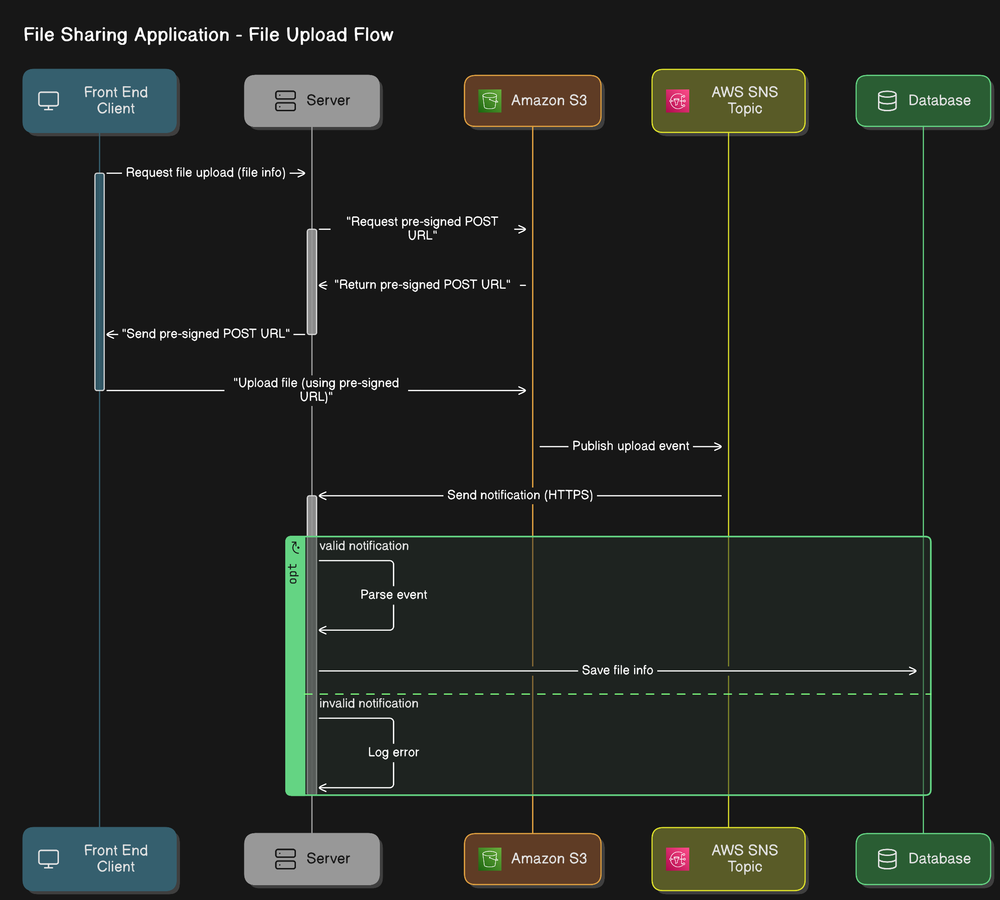
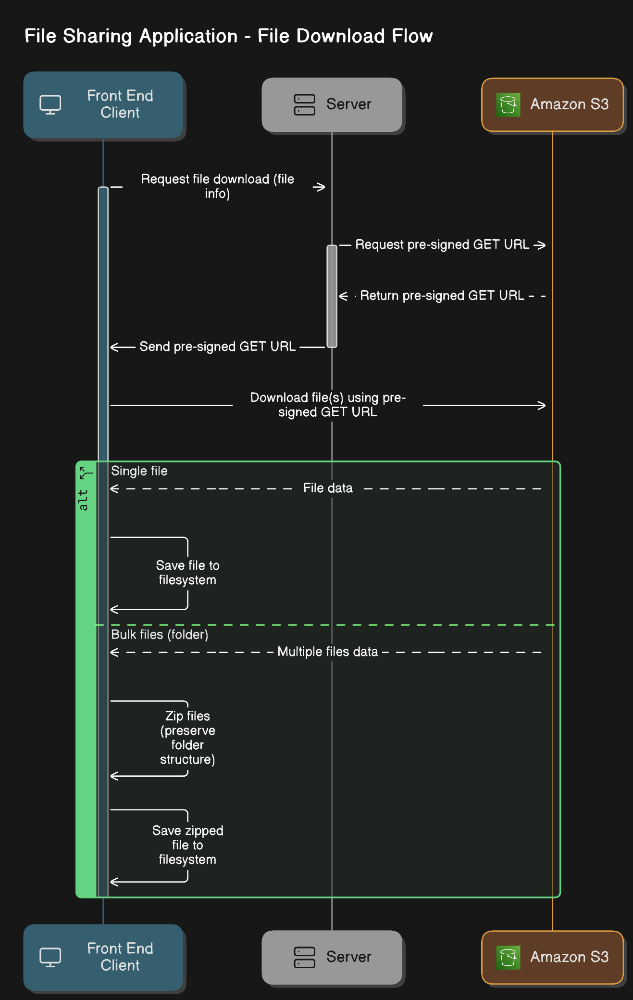

# Conduit

## Lore 🧙

This is the API server for personal project for **Conduit**. A file storage and sharing web application I built so I can store and send my files across my devices. I got tired of using WhatsApp to send files between my PC. Its not a perfect replacement but it works...😊.

### File storage

There are two types of storage (or drives as I call it).

- Personal - A private drive for your personal files.
- Shared - A shared drive where you can store and share files with your friends.

Each user is entitled to 5GB of personal storage, and 10 GB of shared storage upon sign up.

### How it works

Refer to frontend client code here [conduit-ui](https://github.com/SarkiMudboy/conduit-ui)

**Uploading a File**



**Downloading a File**



- It uses an S3 Bucket as primary object storage for the files. Pre-signed URLs are then used to provide temporary access to the client to access the bucket or upload files/folders.
- You can upload bulk files or whole directories and also download the folders as zip files. (This is done on the client's machine).
## Usage

Use Docker to set up and develop locally. Visit [Docker Setup Guide](https://docs.docker.com/desktop/install/windows-install/) for a guide on how to install Docker.

### Build the image

- In the root directory, run the command:

```shell
docker compose build
```

- Wait for the build

### Run the container

- After build is successful, run:

```shell
docker compose up
```

Happy Building!

## Testing

Make sure tests are run at least once before deploying.

To run:

- In the root directory run.

```shell
make test
```

Ensure all tests pass.

Add new tests to the `Makefile` in the format 

```shell
test-[app name here]:
	docker compose run app sh -c "pytest --capture=no path/to/tests"
```

Paths to file should follow the format - app name/tests/test_(feature).py.
